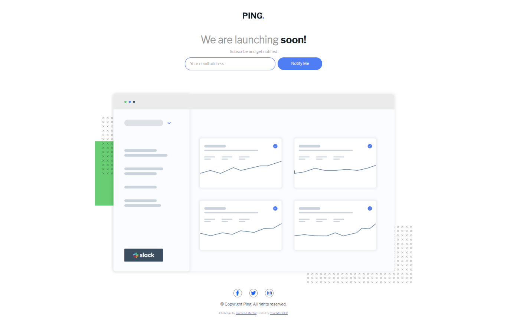

# Frontend Mentor - Ping coming soon page solution

This is a solution to the [Ping coming soon page challenge on Frontend Mentor](https://www.frontendmentor.io/challenges/ping-single-column-coming-soon-page-5cadd051fec04111f7b848da). Frontend Mentor challenges help you improve your coding skills by building realistic projects. 

## Table of contents

- [Overview](#overview)
  - [The challenge](#the-challenge)Ping_coming_soon_page_challenge
  - [Screenshot](#screenshot)
  - [Links](#links)
- [My process](#my-process)
  - [Built with](#built-with)
  - [What I learned](#what-i-learned)
  - [Continued development](#continued-development)
  - [Useful resources](#useful-resources)
- [Author](#author)
- [Acknowledgments](#acknowledgments)


## Overview

### The challenge

Users should be able to:

- View the optimal layout for the site depending on their device's screen size
- See hover states for all interactive elements on the page
- Submit their email address using an `input` field
- Receive an error message when the `form` is submitted if:
	- The `input` field is empty. The message for this error should say *"Whoops! It looks like you forgot to add your email"*
	- The email address is not formatted correctly (i.e. a correct email address should have this structure: `name@host.tld`). The message for this error should say *"Please provide a valid email address"*

### Screenshot



### Links

- Solution URL: (https://github.com/MAXbcv/Ping-coming-soon-page-challenge-on-Frontend-Mentor-)
- Live Site URL: (https://maxbcv.github.io/Ping-coming-soon-page-challenge-on-Frontend-Mentor-/)

## My process

### Built with

- Semantic HTML5 markup
- CSS custom properties
- Js 

### What I learned

```html
<form novalidate>
  <input type="email" placeholder="Your email address" class="">
</form>
```

```js
 
 function verifieremaile(email) {
    let emailRegex = /^[a-z0-9._-]+@[a-z0-9._-]+\.[a-z0-9._-]+$/i;
    if (emailRegex.test(email)) {
      return true
    } else {
      console.log("Error");

      return false
    }
  }

```

### Continued development

### Useful resources

- [Font Awesome](https://fontawesome.com/) - Icon  Facebook , Twitter and Instagrame

## Author

- Frontend Mentor -[MAXbcv] (https://www.frontendmentor.io/profile/MAXbcv)
- GitHub - [MAXbcv] (https://github.com/MAXbcv)

## Acknowledgments

This is where you can give a hat tip to anyone who helped you out on this project. Perhaps you worked in a team or got some inspiration from someone else's solution. This is the perfect place to give them some credit.
